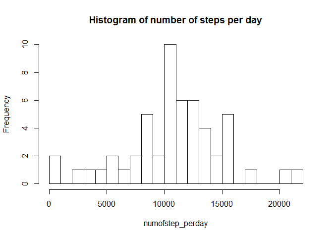
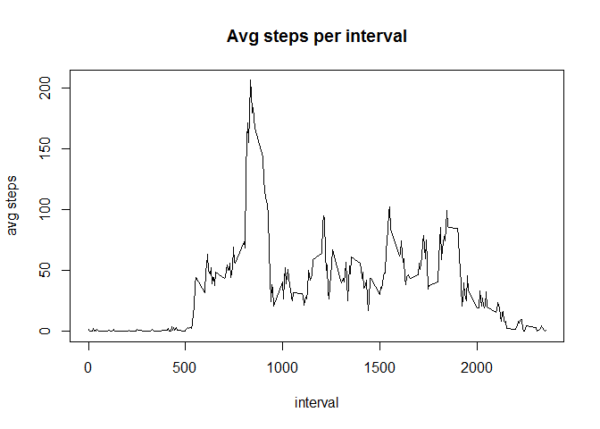
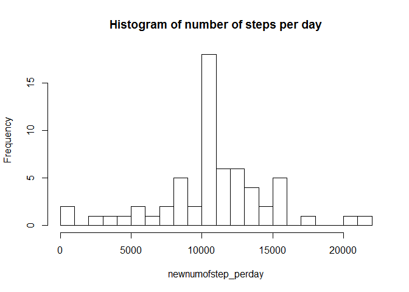
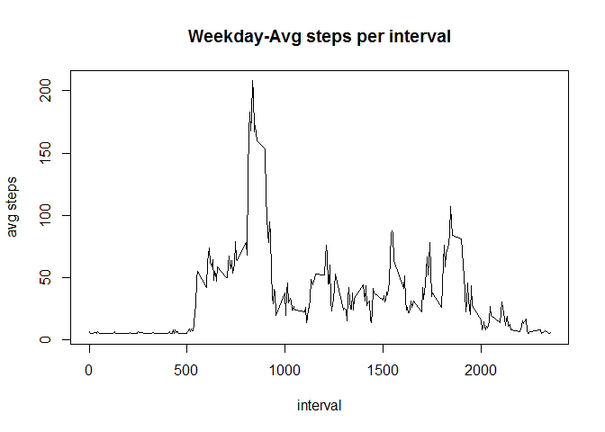
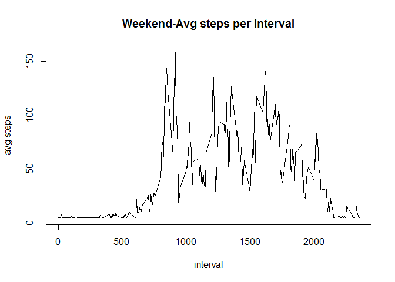

### Loading and preprocessing the data

    activitydata=read.csv("activity.csv",header=T)
    activitydata$date=as.Date(activitydata$date)

### Mean total number of steps taken per day

    numofstep_perday=tapply(activitydata$steps,activitydata$date,sum)

    hist(numofstep_perday,breaks=25,main="Histogram of number of steps per day")

### Mean and median of the number of steps taken per day

    mean(numofstep_perday,na.rm=T)

    ## [1] 10766.19

    median(numofstep_perday,na.rm=T)

    ## [1] 10765

### Average daily activity pattern

    avgsteps_perinterval=tapply(activitydata$steps,activitydata$interval,mean,na.rm=T)
    plot(unique(activitydata$interval),avgsteps_perinterval,type="l",main="Avg steps per interval",xlab="interval",ylab="avg steps")

### Interval with maximum number of steps across all the days

    activitydata$interval[match(max(avgsteps_perinterval),avgsteps_perinterval)]

    ## [1] 835

### Imputing missing values

Number of missing values in the dataset

    sum(is.na(activitydata))

    ## [1] 2304

Imputing the missing values with the average number of steps

    newactivitydata=activitydata
    newactivitydata$steps[is.na(activitydata$steps)] = mean(activitydata$steps, na.rm=TRUE)

### Histogram of number of steps taken each day

    newnumofstep_perday=tapply(newactivitydata$steps,newactivitydata$date,sum)
    hist(newnumofstep_perday,breaks=25,main="Histogram of number of steps per day")

### Mean and median

    mean(newnumofstep_perday)

    ## [1] 10766.19

    median(newnumofstep_perday)

    ## [1] 10766.19

### Differences in activity patterns between weekdays and weekends

Factor to indicate weekend or not

    newactivitydata$weekday=weekdays(newactivitydata$date)
    newactivitydata$weekend=(newactivitydata$weekday=="Saturday" | newactivitydata$weekday=="Sunday")

### Average number of steps taken during weekend and weekday

    library(data.table)
    newactivitydata=data.table(newactivitydata)
    newactivitydataweekday=newactivitydata[!(weekend)]
    newactivitydataweekend=newactivitydata[(weekend)]

    avgsteps_perinterval_weekday=tapply(newactivitydataweekday$steps,newactivitydataweekday$interval,mean)
    plot(unique(activitydata$interval),avgsteps_perinterval_weekday,type="l",main="Weekday-Avg steps per interval",xlab="interval",ylab="avg steps")

    avgsteps_perinterval_weekend=tapply(newactivitydataweekend$steps,newactivitydataweekend$interval,mean)
    plot(unique(activitydata$interval),avgsteps_perinterval_weekend,type="l",main="Weekend-Avg steps per interval",xlab="interval",ylab="avg steps")

